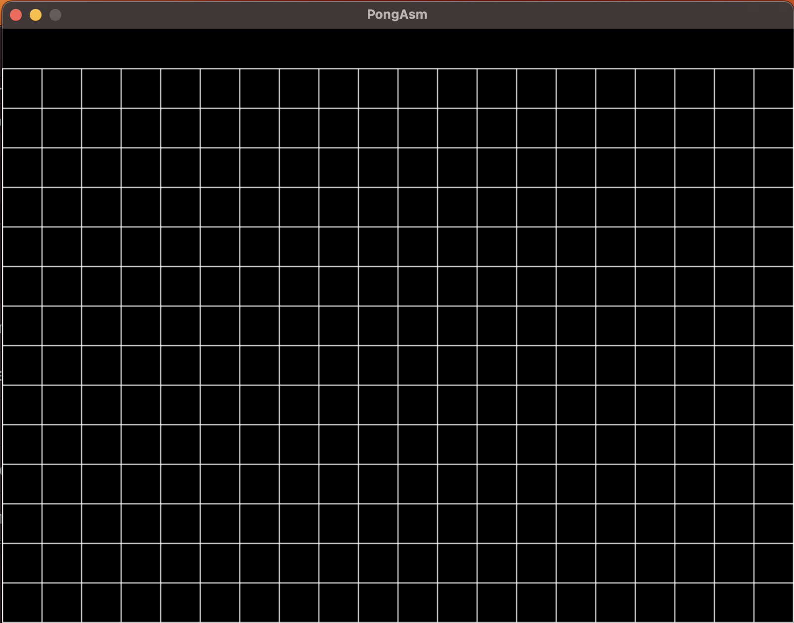

# Snake (ARM64 Assembly)

## Current State

Currently there is no gameplay, but a beautiful grid:


The top is reserved for a future "Score" text

## Requisites
- ARM64 (testet on M1 Processor)
- SDL2 installed
- CMake

## Build
Create build directory: ```mkdir build && cd ./build```

Run CMake: ```cmake ..```

Compile and link: ```make```

Run: ```./pong```
